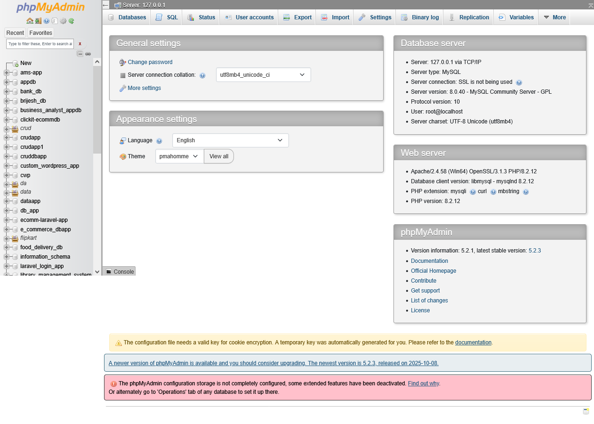
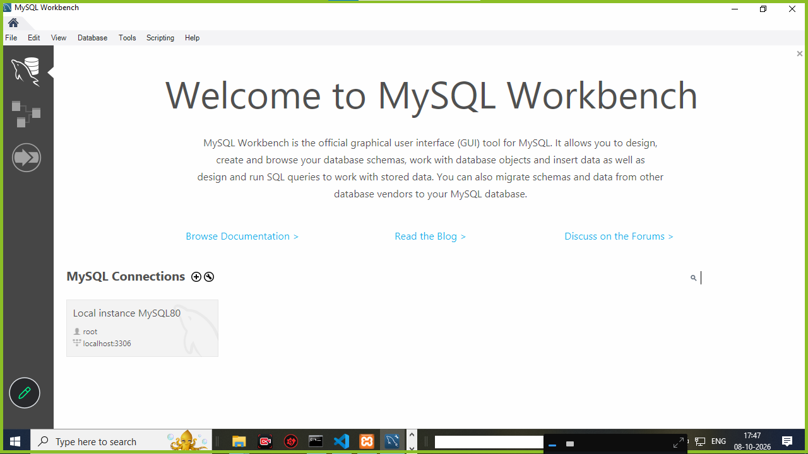
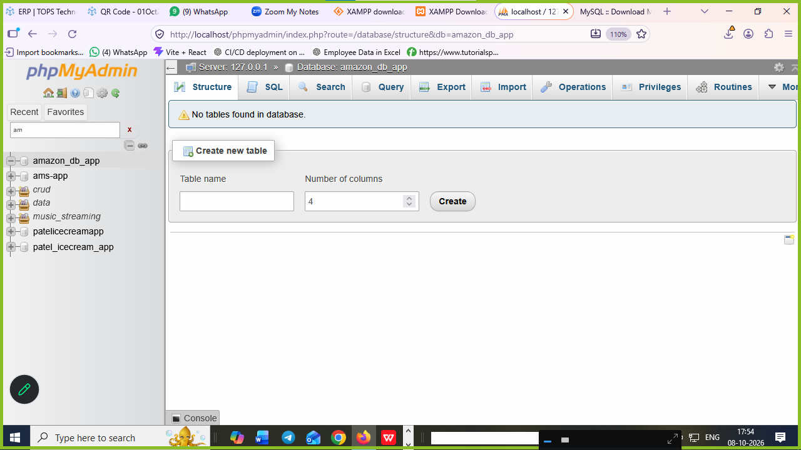

~# what is SQL ?
1. SQL is stands for structured query language 
2. SQL is used to create an structured of **database** and **table**
3. SQL is case insestive language
**examples : insert | Insert | INSERT**

4. SQL is used to created structured 
5. SQL create database
6. SQL also create tables    
7. SQL should not create logic  its create a query 


# DBMS or MySQL setup 
1. download xampp server tools and install
```
https://www.apachefriends.org/

xampp => xampp control => start apache and mysql service

open any broswers 

localhost/phpmyadmin

```



2. download Mysqlworkbench8.0 and install

```
download and install 
start menu mysqlwordkbench

```




# SQL query or command 

# Types of SQL commands ? 

1. DDL (data definition language)
2. DML (data manipulation language)
3. DQL (data query language)
4. TCL (transactional control language) 


# DDL (data definition language)

- DDL used to create database structured 
- DDL is used to create table structured 
- DDL is used to add | modify | rename | change column name from tables 
- DDL also used to rename table name 
- DDL is also used to delete table and database structured 

**query of DDL is :**

1. create 
2. alter 
3. rename 
4. change
5. truncate 
6. drop

# how to create database structured ? 

- create database name 

**syntax**

```
create database databasename;
```

**query**

```
create database amazon_db_app;

```

**screenshot of examples**




# create a table  first know about column name datatype and size

|     columnname           |   datatype(size)       |   key constraints   |
|--------------------------|------------------------|---------------------|
| id                       | int                    | pk auto_increment   |
| name                     | char(0-255)            | not null            | 
| email, password          | varchar(0-255)         | not null            |
| address, comment         | text                   | not null            | 
| multiple choice          | enum                  | not null             | 
| date                     | date                  | not null             |
| datetime                 | datetime              | not null             |
| photo small              | blob                  | not null             | 
| photo big size           | varchar(0-255)        | not null             | 
| salary                   | decimal(10,2)         | not null             | 
| price                    | float, money          | not null             |
| default_date_time        | timestamp             | not null             |


# how to create tables structured in database ? 

- table create in form of **row and column**
**syntax**

```
create table tablename(
columnname datatype(size) primary key auto_increment,
.
.
.
.
column name datatype(size)
)

```